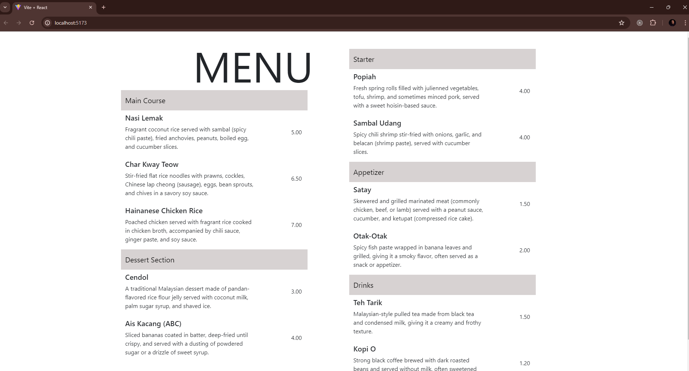
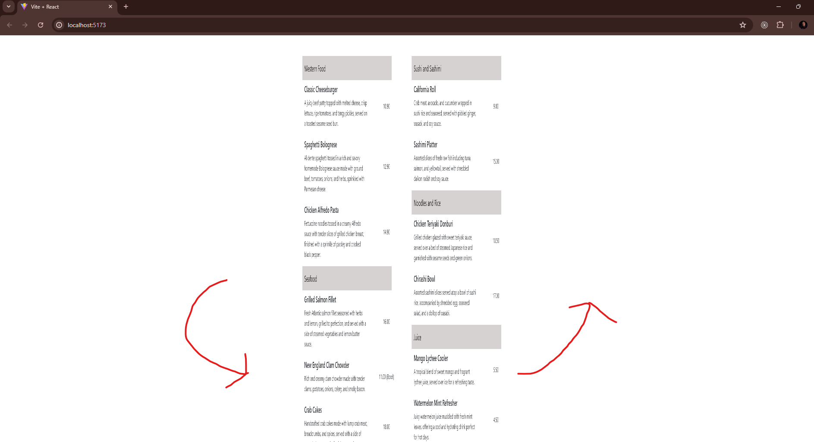
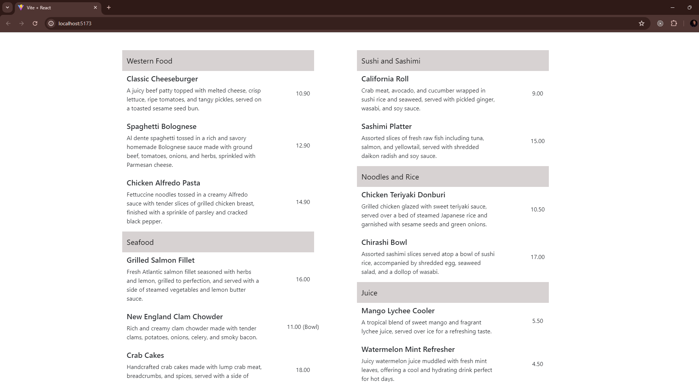

# React Food Menu with 2-page 3D Effect

A recap of the original food menu exercise in Module 2 provided by Sigma School.

## Overview

Initially the exercise presented was just to create a nicely presented food menu. But I wanted to add some dimensional depth to the food-menu (as what you would have real life). Upon click event anywhere on the document, the menu will turn rightwards to display the back-page. 

I realized how lacking my css was as I was struggling to implement a transition effect. Nevertheless, it was a fruitful project as it taught me meaningful ways to structure my content and css to make it possible.

## Installation

Simply download the project. Then type 'npm install' into the console directory to install the required dependencies. Finally, type 'npm run dev' to launch the project into the localhost browser.

## Credit

Thank you to Sigma School for providing me the opportunity to career-switch into the tech field. Exercises/Lessons/Examples were provided by them. https://sigmaschool.co/
